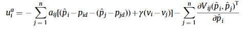
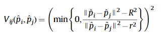
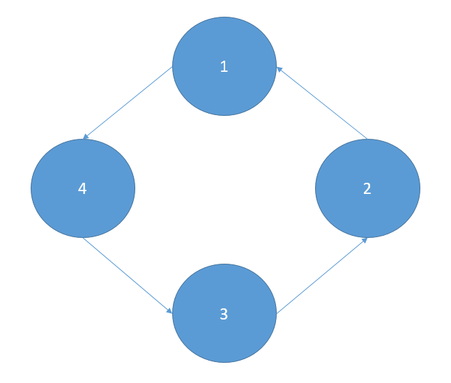
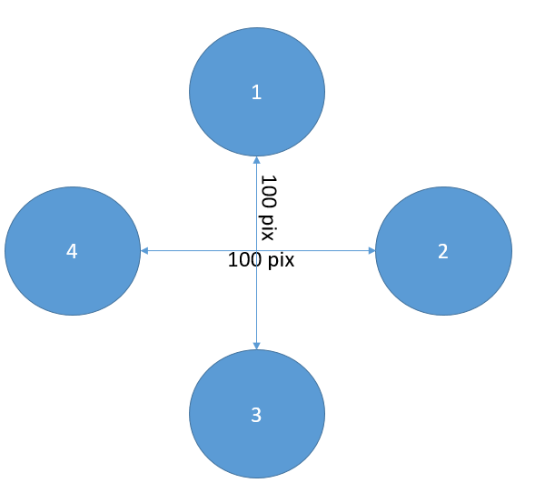
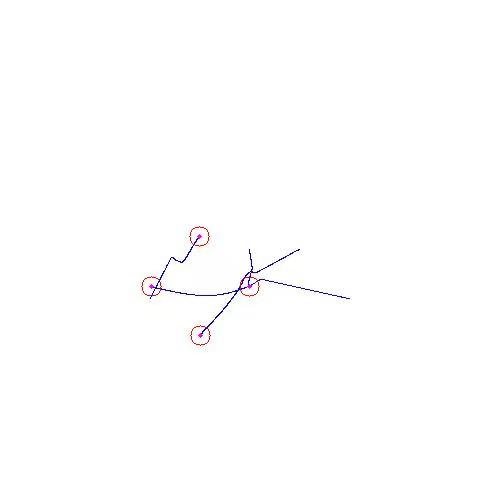

# 具有避碰的编队控制

## 初步
实现上主要依靠这篇论文：[Formation control and collision avoidance for multi-agent systems based on position estimation](<Formation control and collision avoidance for multi-agent systems based on position estimation.pdf>)

简要地说，这篇文章根据引力方向上的一致性协议（consensus protocol）与斥力方向上的能量函数的和，实现编队+避碰：

其中能量函数定义为：

因为$V_{ij} \in [0, \infty)$, 且它及它的导数在目标区间单调，避碰一定可以实现。

然而，本程序的实现与论文有所不同：
- 论文使用了位置估计器，相对位置信息$p_{ij}$是真值;然而感知其他目标并映射回某个坐标系是一件不容易的事(例如常用的智能驾驶方案中往往需要十几个摄像头+至少一个激光雷达)，借助于UWB、GPS可以得到全局位置信息，所以假设$p_i$是已知的，不使用位置估计$\hat{p}_i$。
- 因为实现避碰的能量函数的原因（引入非线性），即使初始所有智能体的速度为0(*所有智能体的速度收敛到速度初值的凸包内，即速度初值全为0则最终速度也为0*)，最终编队的整体速度也不一定为0。所以在控制输入中引入智能体自身速度的负反馈，以期望最终编队的速度是静止的。
- 对能量函数避碰的改造：因为是线性系统，经常出现两个智能体反复对撞的情况，拖长了收敛时间。做了限幅+偏向的处理。

### 程序实现的依据总结：

**智能体模型**：双积分器动态

**网络拓扑**：因为要广播位置信息，图中必需含一个联起所有节点的环，例如下图：

**编队形状**：

**控制律**：在论文的基础上加入自身速度的负反馈，以使最终编队整体速度为0。

<!-- 最终状态：所有智能体的速度收敛到速度初值的凸包内，即速度初值全为0则最终速度也为0；
位置收敛到~ -->
**最终状态**：编队形状收敛到上述形状，并且保持静止。

## 程序组织

需要的依赖：
1. Eigen:
向量、矩阵的数据结构实现，及其运算
2. opencv:
仿真的可视化绘图

程序分为三级：
- **Agent**:智能体动态的实现,分布式算法部署；
- **Formation**:编队的组织与数据结构；
- **Simulator**:可视化

## 效果与展望
最终编队效果：洋红色实心圆为半径2 pix的智能体实体，红色圆为半径为10 pix的感知半径，蓝色线为轨迹。

收敛过程看**output.gif**。

- 后续可以考虑使用gazebo模拟无人机、无人车编队，其动态就不是双积分器模型了，考虑模型预测控制（MPC）;
- 阅读Fei_GAO团队的swarm_formation实现编队，考虑从**优化问题**的方案实现编队。

